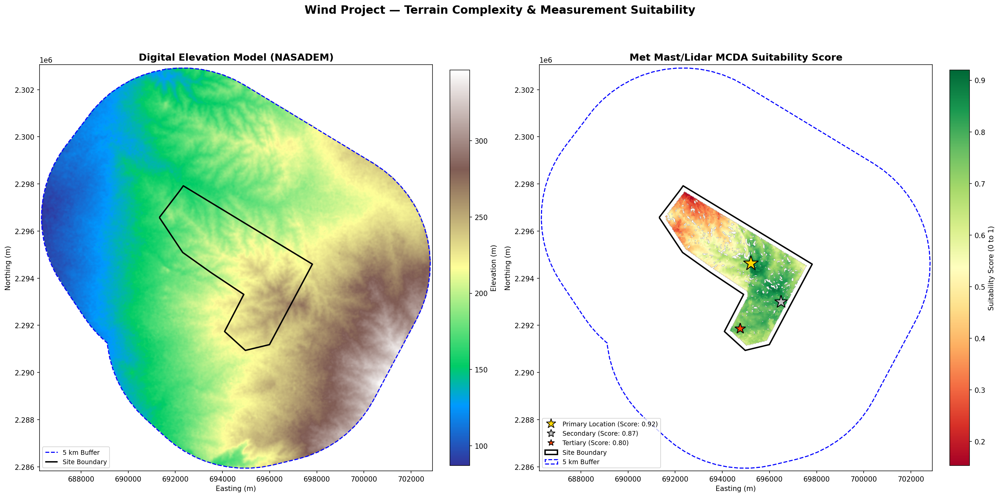

# Wind Resource Assessment: Terrain Complexity & Measurement Siting Memo

> **Generated:** 2026-03-05 11:59 UTC
> **Data Source:** NASADEM 30m resolution 
> **Methodology:** WAsP RIX (ruggedness index), Topographic Position Index (TPI), and Multi-Criteria spatial analysis

---

## 1. Executive Summary

| Parameter | Value |
|-----------|-------|
| **Terrain Complexity Class** | **Semi-Complex Terrain** |
| **Max Site WAsP RIX** | 0.01 % |
| **Max Terrain Slope** | 20.87 % |
| **Complex Terrain (CFD Recommended)** | **FALSE ✅** |

### ⭐ Top 3 Optimal Measurement Candidate Sites

| Rank | Latitude | Longitude | Easting | Northing | Elevation | Suitability Score |
|------|----------|-----------|---------|----------|-----------|-------------------|
| **1** | 20.74122° N | 94.87477° E | 695,203 | 2,294,640 | 233.5 m | **0.920** |
| **2** | 20.72627° N | 94.88690° E | 696,486 | 2,292,999 | 264.8 m | **0.867** |
| **3** | 20.71621° N | 94.87017° E | 694,755 | 2,291,865 | 239.6 m | **0.804** |

**✅ The site is NOT classified as complex terrain.**

---

## 2. Site Description

| Parameter | Value |
|-----------|-------|
| Boundary file | `site_boundary.gpkg` |
| Centroid (WGS 84) | 20.740655° N, 94.869802° E |
| Projected CRS | EPSG:32646 |
| Site area | 19.53 km² |
| Site perimeter | 20.90 km |

---

## 3. Spatial Objective Setup (MCDA)

A Multi-Criteria Decision Analysis (MCDA) framework determines measurement site suitability. A score from 0.0 to 1.0 is synthesized based on professional siting criteria:

- **Topographic Position Index (TPI) (Weight: 0.25):** Evaluates ridge vs valley placement over a 2.0 km radius. Strongly preferencing positive TPI (ridges) for undisturbed dominant flow.
- **Elevation Representativeness (Weight: 0.25):** Targets the 75th percentile of site elevation to ensure measurements are representative of potential turbine array heights, avoiding unrepresentative valley or absolute peak placements.
- **Aerodynamic Distance & LULC (Weight: 0.15):** Buffers heavily forested areas (200.0 m) to reduce uncertainty from displacement heights and induced turbulence. Highly favors grass/bare land.
- **Flatness/Low-RIX (Weight: 0.15):** Pushes sites away from rugged zones reducing flow separation turbulence near the mast.
- **Centrality (Weight: 0.2):** Pulls sites towards the geometric centroid of the parcel for maximum spatial representation.
- **Constraints (Exclusions):** Excludes areas within 200m of boundaries, strictly excludes local slopes > 10.0% (IEC 61400-1 limits), and ensures candidate sites are spaced >2km apart.

---

## 4. Methodologies & Uncertainty Limitations

### 4.1 Terrain Categorical Classification
Wind industry best practice relies on the Maximum WAsP RIX to classify the overall site, minimizing the dilution effect of mean averages in widespread flat sites containing localized cliffs.

- **Simple Terrain:** Max Slope < 15% and Max RIX < 0.5%. Linear models perform perfectly with low uncertainty.
- **Semi-Complex Terrain:** Max Slope > 15% but Max RIX <= 5%. Flow separation is localized. Standard modelling is acceptable if turbines are micro-sited carefully.
- **Complex Terrain:** Max RIX > 5%. Significant widespread flow detachment. Advanced CFD evaluation is required.

**Classification Result: Semi-Complex Terrain**

### 4.2 WAsP RIX & TPI Methodology
- **WAsP RIX:** Fractional area of terrain > 30% slope within a 3.5 km radius focal window.
- **TPI:** The difference between a focal pixel's elevation and the mean elevation within a 2.0 km focal window.

### 4.3 Uncertainty & Limitations
- **DEM Resolution:** NASADEM 30m may underrepresent localized sharp terrain changes (e.g. sharp escarpments or micro-terrain roughness) which a 5m LiDAR DEM could capture.
- **Lack of Wind Direction Analytics:** The MCDA framework does not account for prevailing wind direction. If wind roses are available, measurements should ideally be placed upwind or free from wake of prominent ridges in the dominant flow sector.

### 4.4 Slope Distribution
| Slope Range | Area (%) | Distribution |
|-------------|----------|--------------|
| 0–2 %      |  15.10 % | ████████ |
| 2–5 %      |  46.55 % | ███████████████████████ |
| 5–10 %     |  34.60 % | █████████████████ |
| 10–15 %    |   3.39 % | ██ |
| 15–20 %    |   0.26 % |  |
| 20–30 %    |   0.09 % |  |
| 30–100 %   |   0.01 % |  |

---

## 5. Recommendations

### ✅ Terrain Within Standard Limits

Standard measurement and flow modelling procedures should be sufficient:

1. **Linearised flow models** (WAsP, OpenWind) are expected to perform adequately with low uncertainty.
2. **Measurement Strategy** — Standard measurement campaigns (Met Masts) can be used. Primary recommended site: (20.741224°N, 94.874772°E).
3. **Array Micro-siting** — Ensure turbines are not sited exactly on the minor local slopes exceeding 15%.

---

## 6. Terrain Analysis Map

- **Left panel:** NASADEM elevation with site boundary (black) and 5 km buffer (blue dashed).
- **Right panel:** MCDA Suitability Heatmap. ⭐ marks the optimal monitoring locations ranked 1, 2, and 3.

---

*Report generated automatically by the Terrain Analysis Pipeline.*
